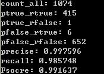
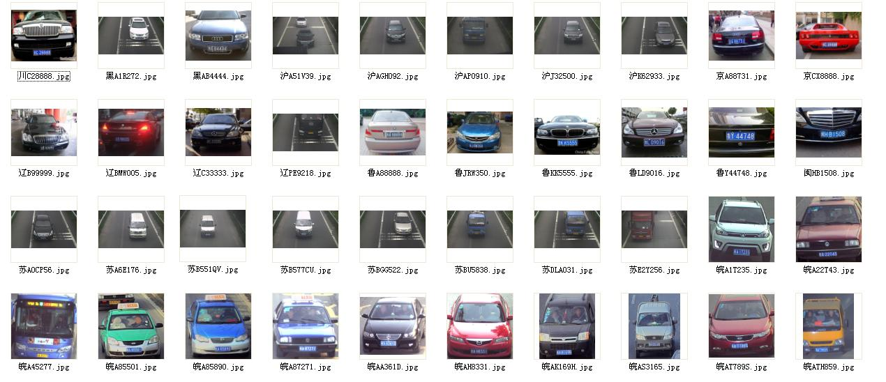
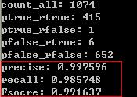

EasyPR版本更新
======

本次更新是1.2版，主要改进在于提升了车牌定位模块的准确性，从70%左右到目前的94%，见下图：

主要改动如下：

* 车牌定位使用了“颜色信息”+“二次Sobel”的综合搜索方法。在下面的window中红框代表Sobel定位结果，黄框代表颜色定位结果。

* “批量测试”增加了一个结果查看window，这个窗口可以用SetDebug()方法开闭(true开，false关)。

* 基本攻克了“大角度定位”问题，下图的车牌被定位并转到了正确的视角。

* GDTS里新增了若干张新测试图，包括数张大角度图。

* “批量测试”结果现在同时会保存在“run_accuracy”文件中，可以查询历史信息。

* 与Linux版本做了整合，可以实现跨平台编译。

======

目前EasyPR的版本是1.1，相比上一个版本1.0，有以下更新（这次的更新内容较多，为了跟你现有的项目和代码不冲突，请
谨慎选择全部更新，最好新起一个目录试试新增的功能和内容）：

* 新的SVM模型。新模型使用rbf核替代了liner核，在车牌判断的准确率提升了8个百分点。

* 新增两个特征提取方法。并提供了相关的回调函数接口供二次开发。

* 新增Debug模式。可以在tmp文件夹下看到所有输出的中间图片。

* 增加了LifeMode模式，相比默认模式，更适合在生活场景下定位车牌。

* 增加了批量测试功能，这个功能可供测试EasyPR在多幅图片上的整体表现效果。

 

* 引入了GDTS(General Data Test Set，通用数据测试集)这个概念，作为EasyPR准确率的评测数据集。

* 为了确保GDTS的数据仅用于非商业目的，引入了新的[GDSL协议](../image/GDSL.txt)。

* 完善SVM训练功能。提供了一个方便简单的训练窗口。这些增加的功能是为了配合即将推出的SVM开发详解这篇文章。

* 强化SVM模型验证。使用了三个新的数据集概念，即learn data，train data，test data。

* 新增评价指标。引入Precise，Recall，FSocre三个指标这三个指标作为SVM模型准确率评判的参数与改善的依据。

* 新增整体指标。引入levenshtein距离作为EasyPR整体识别准确率误差的评判参数与改善依据。

  

* 大幅增加训练数据。SVM训练数据中增加了近千张新数据(未经直方图均衡化的车牌图片和非车牌图片)。

请自行解压train/data/plate_detect_svm/learn下的压缩文件查看相关信息。

* 新增命令行窗口，作为测试与训练的辅助工具。

注意：上一个版本中image文件下的test.jpg如果有同学下载了，请删除。它的格式不符合新的GDSL协议的约定。
如果想使用测试图片，可以使用1.1版本中新增的test.jpg替代。
